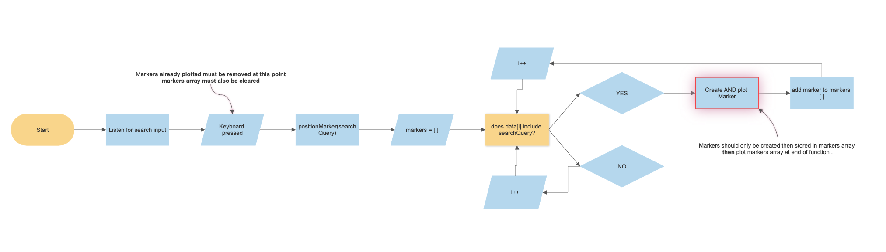
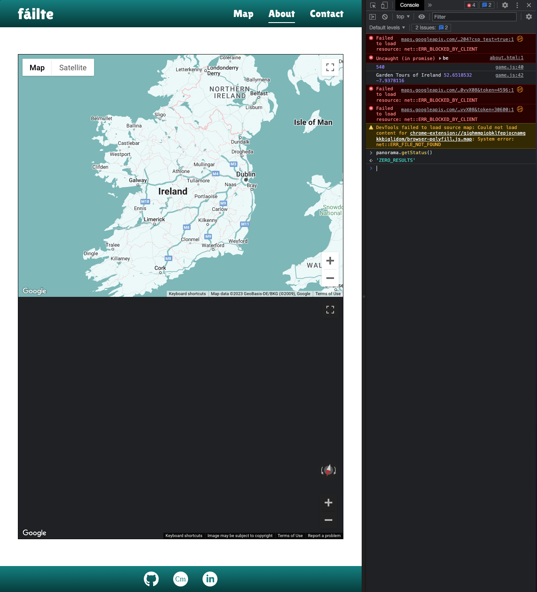

# failte-pp2

# Bugs and Issues

- During the initial stage of development, when fetching the Attraction Data from the Fáilte Ireland API, it would only return a maximum of 50 results as results are paginated. Documentation for the API is non-existant/inaccessible at time of writing and I could not determine a solution. However, I was able to download the full dataset in CSV format which I could then parse to JSON using [CSVtoJSON](https://csvjson.com/csv2json) and `fetch` the file locally which turned out to be a simpler and better solution.
- The biggest challenge was implementing the search feature so that it functions as desired. During development, I was able to make Attractions which matched the search query appear on the map, however when I cleared or editted the search input, the Attractions remained on the map as I had not told the program to clear the map when a new search query is made. Drawing up a flowchart helped me think through the logic of my code and the issue and solution became obvious after doing this.

- When testing on an iPhone XS Max, it was noted that the site did not fit within the viewport as intended. This was due to `vh` units not taking into account the native browser UI elements such as the toolbar etc. I found a solution on [Stack Overflow](https://stackoverflow.com/questions/58886797/how-to-access-the-real-100vh-on-ios-in-css): a newer CSS unit - `dvh` (Dynamic Viewport Units) - takes into account the browser UI and changing any `vh` units in my CSS to `dvh` fixed this issue and the site now displays as intended. This was tested on all major mobile browsers (Chrome, Edge, Safari, Firefox, Opera, DuckDuckGo) wihtout issue.

- After implementing the search functionality, I tested it on an iPhone XS Max and it would not return any search results. I found that the iPhone keyboard was automatically setting the first character to uppercase, and I had not made the search query function case-insensitive. This was fixed by simply adding `.toLowerCase()` to the `searchQuery` argument in my app.
")
- When implementing the geo-guessing game, on occasion the app was trying to load a non-existent Street View at a Lat/Long location that did not have Street View on Maps (e.g. on private property or an inaccessible attraction). To fix this bug, I first had to study the Maps API Documentation more thoroughly and re-write my functions to allow for reading the promise response after checking the status of the Street View request. I then wrote logic that would check if the Street View is valid, and if not, try again.

# Credits

### Assets
- Attraction data: [Fáilte Ireland OpenData API](https://failteireland.developer.azure-api.net/api-details#api=opendata-api-v1&operation=attractions-csv)
- Map: [Google Maps API](https://developers.google.com/maps)
- Map Marker Icons: [Geoapify](https://www.geoapify.com/free-map-icons)
- Favicon: 
- Misc. Icons: [Font Awesome](https://fontawesome.com/)
- Code Snippet README Images: [Carbon](https://carbon.now.sh/)
- Flow Diagram: [SmartDraw](https://cloud.smartdraw.com/)

### Educational Resources
- [MDN Documentation](https://developer.mozilla.org/en-US/)
- [Working with Data and APIs in JavaScript, The Coding Train](https://www.youtube.com/watch?v=DbcLg8nRWEg&list=PLRqwX-V7Uu6YxDKpFzf_2D84p0cyk4T7X)
- [Google Maps API JavaScript Tutorial, Traversy Media](https://www.youtube.com/watch?v=Zxf1mnP5zcw&ab_channel=TraversyMedia)
- [The Web Developer Bootcamp 2023, Colt Steele](https://www.udemy.com/course/the-web-developer-bootcamp/)
- [Google Maps JavaScript API Documentation](https://developers.google.com/maps/documentation/javascript)